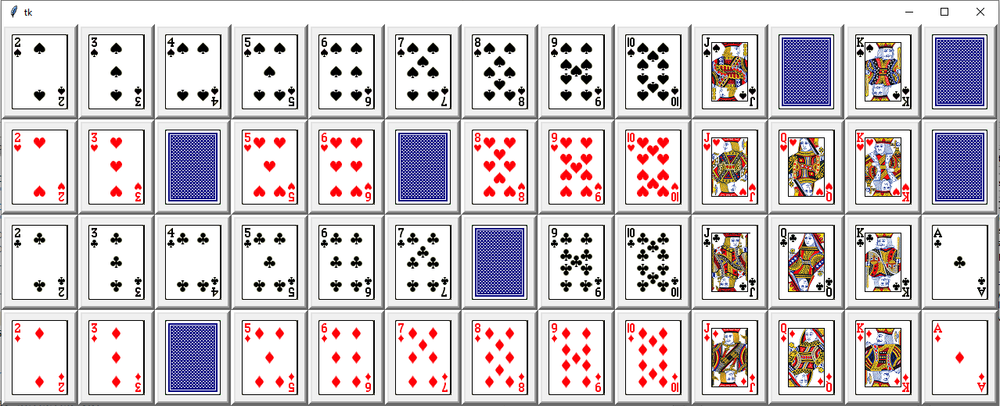

# Prerequisites

The poker probability calculator requires to install first `itertools` and `tkinter` packages, with the following commands:

```sh
sudo apt-get install -y python-more-itertools
```

```sh
sudo apt-get install python-tk
```

# Getting Started

The program can be launched directly with:

```sh
python main.py
```

# Main Interface

The main interface is displayed with the different cards of the game.


<br />

# Card Selector

The value of a card can be changed by clicking on it. Then the card selector appears and enables the player to select the desired value of his card.



<br />

Clicking on a card face down (on the card selector) resets the value of the card (on the main interface).

<br />

# Computation

The winning probabilities can be computed by clicking on the right button of the main interface.

<p float="left">
   &nbsp;  
  </pre>
</p>


<br />

The probabilities can be computed in different scenarios but require to select at least the main player cards and either the flop or the opponent cards.

